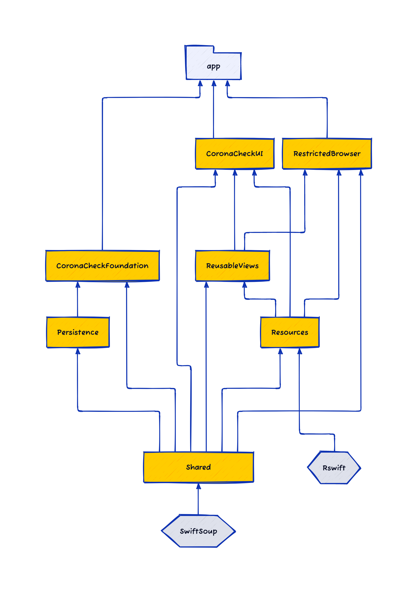

# COVID-19 CoronaCheck - iOS

## Introduction

This repository contains the iOS release of the Dutch COVID-19 CoronaCheck project.

* The iOS app is located in the repository you are currently viewing.
* The Android app can also be [found on GitHub](https://github.com/minvws/nl-covid19-coronacheck-app-android).

See minvws/**[nl-covid19-coronacheck-app-coordination](https://github.com/minvws/nl-covid19-coronacheck-app-coordination)** for further technical documentation.

---

## About the Apps

The codebase was building two different app products: 

### [CoronaCheck](https://apps.apple.com/nl/app/coronacheck/id1548269870)

**CoronaCheck** (referred to internally as the *Holder* app) was the official app of the Netherlands for showing coronavirus entry passes. With this digital tool, you could a certificate with QR code of your negative test, vaccination, or recovery. This allowed access to certain venues and activities abroad. Or at the border.

### [Scanner voor CoronaCheck](https://apps.apple.com/nl/app/scanner-voor-coronacheck/id1549842661)

**CoronaCheck Scanner** (referred to internally as the *Verifier* app) was the official scanner app of the Netherlands for coronavirus entry passes. With this digital tool, you could verify if visitors have a valid certificate of their negative test, vaccination, or recovery. You did this by scanning their QR code. This way, you could safely give access to your venue or activity.

### App Requirements

The apps can run on devices that meet the following requirements.

- Operating System: iOS 11.0+
- Internet connection (either Wifi or Mobile Data)

### Accessibility

The latest accessibility audit can be found at [2023-05-27 Toegankelijkheidsonderzoek CoronaCheck 4.13 (iOS) versie 3.0.pdf](/Accessibility/2023-05-27 Toegankelijkheidsonderzoek CoronaCheck 4.13 (iOS) versie 3.0.pdf)

### Feature Overview

#### CoronaCheck

The app does not work anymore, it just opens informing the user about the current deactivated status, with a link to a website offering the last available information for the corona passes.
To check previous features of the app, check out one of the previous releases/tags.

### Dependencies

There are a number of Swift Packages in `Packages/`, which the app target depends on. Here is the dependency graph: 

The majority of our third-party dependencies are included as Swift Packages. Here is an overview of what dependencies are used and why.

* [RSwiftLibrary](https://github.com/mac-cain13/R.swift.Library): for strongly-typed, autocompleted resources like images, fonts, colours.

* [SwiftSoup](https://github.com/scinfu/SwiftSoupSwiftSoup): for parsing and sanatizing HTML

#### Development only

* [XcodeGen]([https://github.com/yonaskolb/XcodeGen](https://github.com/minvws/nl-covid19-notification-app-ios/blob/main)): Command Line tool to generate an Xcode projectfile based on a [project.yml](/.project.yml) description file. The .xcodeproj file that is generated by this tool is not checked into the git repository but has to be created when checking out the code by running `make generate_project`.

#### Testing only

* [Nimble](https://github.com/Quick/Nimble): for succinct unit test expressions.
* [SnapshotTesting](https://github.com/pointfreeco/swift-snapshot-testing): for recording the expected state of UI components.

#### Continuous Integration only

* [Fastlane](https://github.com/fastlane/fastlane): for automating the build and distribution pipeline.

## Development

### Build Requirements

To build and develop the app you need:

- Xcode 14
- Xcode Command Line tools (Specifically "Make").
- [Homebrew](https://brew.sh/)
- [Git](https://git-scm.com/)

### Getting started

The Xcode project file ([CTR.xcodeproj](CTR.xcodeproj)) is not checked-in to git. Instead, we generate it dynamically using [XcodeGen](https://github.com/yonaskolb/XcodeGen) based on [project.yml](/.project.yml). 

There is a [Makefile](./Makefile) which makes it easy to get started (if you encounter any issues running this, please do open an issue):

Simply run `make dev` from the command line.  

It will use [Homebrew](https://brew.sh) to install [these tools](./Brewfile), and will install githooks for:

* GitLFS (which will download the [snapshot](https://github.com/pointfreeco/swift-snapshot-testing) PNGs used in our unit tests)
* XcodeGen (which will update the Xcode project each time you change branches)

It will run `bundle install` to setup your [Ruby dependencies](./Gemfile) such as [fastlane](https://fastlane.tools).

Lastly, it will generate and open the Xcode Project for you. You should run the `Holder Dev` scheme targetting a simulator to get started..

### Continuous Integration & reproducible builds

In order to facilitate CI and reproducible builds, this codebase can be built using Github Actions.

### Where to begin development

The app uses a few mainstream iOS architectural concepts throughout:

* App Coordinator https://khanlou.com/2015/10/coordinators-redux/
* Environment https://www.pointfree.co/episodes/ep16-dependency-injection-made-easy
* ViewModels https://www.swiftbysundell.com/articles/different-flavors-of-view-models-in-swift/

#### Key classes:

`AppCoordinator` is the main starting point of the app.

#### Localized Strings

Localization was managed in a [lokalise](https://lokalise.com) project.

Localisation assets could be downloaded from lokalise using the command `make download_translations`. 

The Lokalise CLI (which this triggers) downloads separate `.strings` and `.stringsdict` files for the Holder and Verifier projects. 

We pipe these assets through R.swift as a build phase to create a static list of translated strings, and for convenience (keys shared between both projects are created in the Holder project) we first merge the Holder and Verifier assets together, before the R.swift step runs. This is done by the [merge_localizations.sh](Scripts/merge_localizations.sh) script. This script also issues a warning if any duplicate keys are detected after this merge (i.e. if a key appeared in both Holder and Verifier, indicating a clash).

Many strings contain HTML tags for basic markup (`<b>`, `<i>`, `<ul>` etc). It was found that it was easy for a copy-writer to make a mistake inputting these HTML tags in their CMS web interface, and if these mistakes were undetected then it could make labels render strangely in the app at runtime. 

To combat that, [a very basic HTML syntax validator](Scripts/strings_checker.swift) was written which outputs at build time warnings about the common mistakes that it checks for, for example:

> Closing a tag `<a>` which doesn’t match the last opened tag `<b>`

#### Colors, Images

R.swift collates the colors and images from bundled asset catalogs, generating a Swift file with an accessor for each asset.

#### Fonts

Fonts are accessible via `Fonts.swift`

## Release Procedure

The release process is the same for CoronaCheck and for CoronaCheck Scanner.

We use fastlane to automate our release processes, and that is executed by GitHub Actions. See [.github/workflows](.github/workflows) for the workflows definition files.

We release test, acceptance and production-like builds internally to Firebase App Distribution. These are triggered whenever there is a commit made to the main branch (ie by merging a pull request).

You can also manually trigger this release process manually, by running the [Deploy: Firebase (manual)](.github/workflows/deploy-firebase-manual.yml) github action and providing a branch name.

Once it is time to start the release train, create a release branch with the format `release/holder-4.7.0` or `release/verifier-4.7.0`, and then increment the `MARKETING_VERSION`  (for Holder or for Verifier) in [project.yml](project.yml). Pushing to this branch will trigger the appropriate Firebase builds.

Once the team is satisfied with the quality of the builds on Firebase, a production build can be sent to TestFlight. A release to TestFlight is kicked off by *tagging* a commit using this format:

`Holder-4.7.0-RC1`, `Holder-4.7.0-RC2`, etc.

or `Verifier-3.0.2-RC1`, `Verifier-3.0.2-RC2`, etc.

Here we perform a manual regression test on the build to make sure the production-ready binary performs as expected.

Once the build is approved by Apple, we release the approved build manually using a phased rollout to give us the opportunity to spot any crashes that might be detected, or bugs that might be reported. At this point  a final tag should be made, with this format:

`Holder-4.7.0`

`Verifier-3.0.2` 

Now that the release is completed, the private git repository should be "synced" with the public reposititory by running `make sync_repo`. It pushes new *non-RC* tags to the public repository. This command is part of the [RDO Repository Tools](https://github.com/minvws/nl-rdo-git-repository-tool). 

## Contribution process

The development team works on the repository in a private fork (for reasons of compliance with existing processes) and shares its work as often as possible.

If you plan to make non-trivial changes, we recommend to open an issue beforehand where we can discuss your planned changes. This increases the chance that we might be able to use your contribution (or it avoids doing work if there are reasons why we wouldn't be able to use it).

Note that all commits should be signed using a gpg key.
